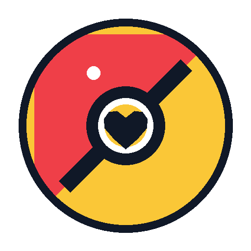

<div align="center">
  
  <h1>PocketMen with You</h1>
  <p><strong>Turn 2+ photos into a high-fidelity Codex companion — locally.</strong></p>
<p><strong>v0.3: Neural Local Studio. No hatch-pet. No OpenAI API key. Open-weight multi-reference editing when your GPU can run it.</strong></p>
  <p>
    
    
    
  </p>
  <p><a href="https://github.com/six-nut/PocketMen-with-you/releases/tag/v0.3.0"><strong>Try now</strong></a> · <a href="https://github.com/six-nut/PocketMen-with-you"><strong>⭐ Star</strong></a> · <a href="https://github.com/six-nut/PocketMen-with-you/discussions/11"><strong>Share example</strong></a></p>
</div>

[简体中文](README.zh-CN.md)

## Why v0.3 exists

The deterministic v0.2 engine was reliable and private, but it could only warp supplied pixels. It could not genuinely invent a new waving hand, a natural running stride, a faithful kitten pose, or a polished 3D chibi redesign.

v0.3 adds a **real local generative engine**. When supported hardware is present, PocketMen uses an open-weight multi-reference image editor to create a canonical master and state-specific animation key poses, then applies deterministic micro-motion, atlas assembly and QA. The result is far closer to a modern hosted image editor while remaining independent from OpenAI ImageGen.

## Engine stack

```text
2+ reference images
        ↓
Codex visual identity lock
        ↓
PocketMen hardware doctor
        ↓
┌─────────────────────────────────────┐
│ Neural Local Studio                 │
│ default: FLUX.2 [klein] 4B          │
│ optional: Qwen-Image-Edit-2511      │
│ multi-reference identity editing    │
└─────────────────────────────────────┘
        ↓
canonical master + semantic key pose per state
        ↓
flat chroma extraction / alpha cleanup
        ↓
deterministic micro-animation
        ↓
8 × 9 transparent Codex atlas
        ↓
validation + contact sheet + GIF previews
        ↓
pet.json + spritesheet.webp
        ↓
Codex local install
```

If the neural runtime or compatible GPU is unavailable, PocketMen falls back to the deterministic v0.2 engine instead of asking for `OPENAI_API_KEY`.

## Local neural backends

### FLUX.2 [klein] 4B — default

- local text-to-image and image editing;
- multi-reference input;
- Apache-2.0 weights;
- suitable for consumer NVIDIA GPUs;
- selected automatically on compatible hardware.

### Qwen-Image-Edit-2511 — Identity-Max

- multi-image editing;
- strong character consistency and viewpoint editing;
- Apache-2.0;
- heavier than the default backend;
- install explicitly when identity fidelity matters more than setup size or latency.

PocketMen intentionally does **not** make FLUX.2 [dev] the default because its model license is non-commercial.

## Quality profiles

- `draft`: one neural canonical master, deterministic nine-state animation.
- `balanced`: canonical master + state-specific neural key poses; left-running may derive from right-running to reduce drift.
- `max`: canonical master + independently generated key pose for every state.

## Quick start in Codex

Upload at least two images and ask:

```text
Use $pocketmen-with-you to create and install a companion from these references.
Use Neural Local Studio when my hardware supports it.
Style: hero-chibi.
Subject type: person.
Quality: max.
Preserve identity strictly and do not use hatch-pet or any OpenAI API key.
```

The skill should visually summarize stable identity traits from the references and pass them through `--identity-notes`.

## CLI

Hardware check:

```bash
pocketmen doctor
```

Create with automatic engine selection:

```bash
pocketmen create \
  --reference photo-1.jpg \
  --reference photo-2.jpg \
  --name "Mochi" \
  --subject-type animal \
  --style soft-real \
  --engine auto \
  --quality balanced \
  --output ./pocketmen-output \
  --install
```

Force the default neural model:

```bash
pocketmen create ... --engine neural --backend flux2-klein-4b --quality max
```

Use the heavier identity backend:

```bash
pocketmen create ... --engine neural --backend qwen-image-edit-2511 --quality max
```

## One-click setup

`INSTALL_SKILL.bat` installs the skill and creates an isolated runtime. On Windows, the installer checks NVIDIA VRAM; a compatible machine automatically receives the neural dependency profile.

To explicitly prepare and cache the default local neural model:

```text
PREPARE_NEURAL_ENGINE.bat
```

For Qwen Identity-Max:

```text
PREPARE_IDENTITY_MAX.bat
```

Model weights are downloaded from their original model hosts into the normal Hugging Face cache; they are not committed to this repository.

## Codex pet contract

PocketMen emits an 8-column × 9-row atlas, 192×208 per cell, 1536×1872 overall. States are:

`idle`, `running-right`, `running-left`, `waving`, `jumping`, `failed`, `waiting`, `running` (Codex working, not physical running), and `review`.

## What “ImageGen-like” means here

PocketMen narrows the quality gap specifically for **reference-driven Codex companion creation** by combining strong open-weight image editing, multi-reference identity anchors, structured prompts, dedicated state generation, deterministic alpha extraction and strict atlas QA.

It does **not** claim bit-for-bit or general-purpose parity with a proprietary frontier model. Broad world knowledge, typography, complex scene reasoning and difficult multi-object composition can still differ. For the narrow “2+ photos → consistent animated companion” workflow, however, v0.3 is designed to use the strongest local path available before falling back to simple warps.

## Privacy

Raw personal references remain local by default and are never copied into public Git commits/releases. The final install package contains only `pet.json` and `spritesheet.webp`.

## License

PocketMen code: MIT.

Optional model weights retain their own licenses. The default FLUX.2 [klein] 4B and Qwen-Image-Edit-2511 backends are referenced, not redistributed.

PocketMen with You is not affiliated with Nintendo, The Pokémon Company, Game Freak, OpenAI, Black Forest Labs, Alibaba/Qwen, Hugging Face, or GitHub.
